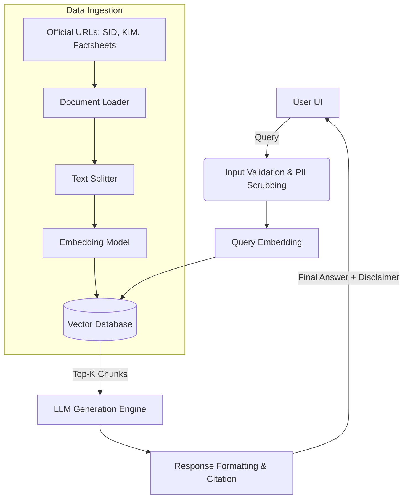

# Architecture Document: Mutual Fund FAQ Assistant

## 1. System Overview
The system is a lightweight Retrieval-Augmented Generation (RAG) based AI assistant designed specifically to answer factual questions about a predefined set of 10 mutual fund schemes. The primary goal is to ensure 100% accurate, source-backed responses while strictly refusing to provide any financial or investment advice.

## 2. High-Level Architecture
The architecture comprises three main pipelines:
1. **Data Ingestion Pipeline (Offline):** Extracts, chunks, and embeds text from official documents.
2. **Retrieval Pipeline (Online):** Processes the user query, generates a semantic representation, and fetches the most relevant factual snippets.
3. **Generation Pipeline (Online):** An LLM evaluates the retrieved snippets against strict factual guardrails to generate a concise, cited response or execute a safe refusal.

## 3. Component Details

### 3.1. Data Ingestion & Storage
- **Sources:** SIDs, KIMs, and monthly factsheets directly from AMC websites for the 10 selected funds, plus AMFI/SEBI general guidelines.
- **Processing:** 
  - PDFs and web pages are parsed to extract plain text and tabular data.
  - Text is chunked (e.g., using RecursiveCharacterTextSplitter) with appropriate overlap to preserve context (e.g., keeping table rows and section headers together).
  - Metadata is attached to every chunk. **Crucial metadata includes:** Source URL, Document Type, Fund Name, and Last Updated Date.
- **Storage:** Embeddings are generated (e.g., via HuggingFace `BGE-base-en-v1.5` — 768-dim vectors) and stored in a Vector Database (e.g., ChromaDB, FAISS, or Qdrant).

### 3.2. Retrieval Engine
- **Similarity Search:** Converts user queries into vector embeddings and retrieves the top-K semantically similar chunks.
- **Metadata Filtering (Optional):** If the user mentions a specific fund (e.g., "Parag Parikh Flexi Cap"), the retrieval can pre-filter chunks where the metadata matches the fund name to reduce hallucinations and improve accuracy.

### 3.3. LLM Generation & Prompt Engineering
The LLM is tightly constrained via a **System Prompt**. It operates as a strict factual summarizer rather than a conversational agent.

**Prompting Rules:**
- **Context Only:** "Answer the user's question *only* using the provided context. If the answer is not in the context, say 'I do not have this information'."
- **Length Constraint:** "Limit your response to a maximum of 3 sentences."
- **Citation Mandate:** "You must include exactly one source link derived from the metadata of the context used."
- **Refusal Handling:** "If the user asks for investment advice, opinions, or performance comparisons, politely refuse, state you are a facts-only assistant, and provide a link to AMFI/SEBI."
- **Performance Queries:** "If asked about past returns, do not state the numbers; instead, provide the URL to the fund's official factsheet."

### 3.4. User Interface (UI)
A minimal, lightweight frontend (e.g., Streamlit or a simple React app) designed for quick information retrieval.
- **Elements:**
  - Welcome banner.
  - Three clickable example questions (e.g., "What is the exit load for Parag Parikh Long Term Value Fund?").
  - A persistent, highly visible disclaimer: *"Facts-only. No investment advice."*
  - Chat input box.

## 4. Security, Privacy & Compliance
- **No PII Handling:** The UI will not ask for or store user identities. Any accidental PII input (like a PAN or account number) in the chat prompt will be scrubbed via Regex before being sent to the LLM/Embedding models.
- **No Generative Advice:** The system strictly prevents dynamic calculations (e.g., "If I invest 1000 a month for 5 years...").
- **Stateless Chat:** To prevent the LLM from being "jailbroken" over a long conversation, the chat context window is either kept extremely short or completely stateless (treating each query independently).

## 5. Technology Stack (Recommended)
- **Frontend / UI:** Streamlit (Python) or Next.js
- **Orchestration / Framework:** LangChain or LlamaIndex
- **Embedding Model:** HuggingFace `BGE-m3` (or equivalent BGE model)
- **Vector Database:** ChromaDB (local/lightweight) or Pinecone
- **LLM:** Groq (highly capable, extremely fast for strict formatting constraints and refusals)
